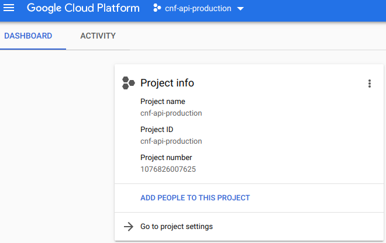
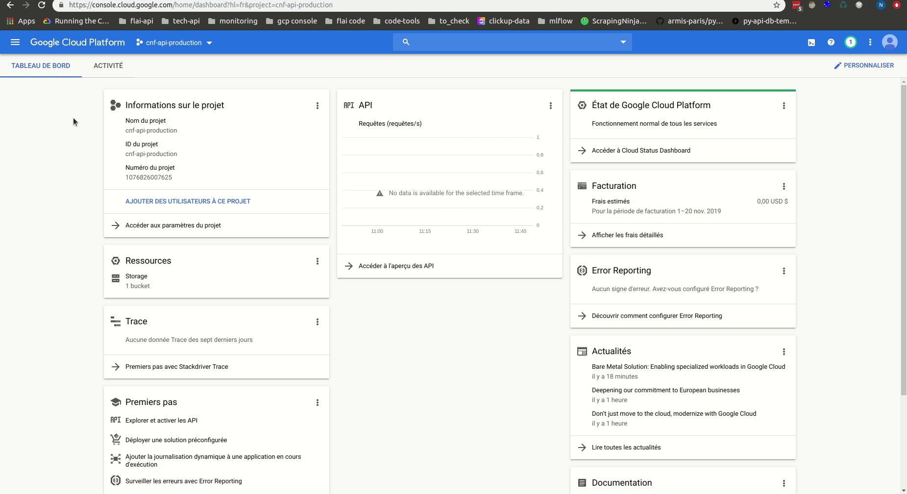
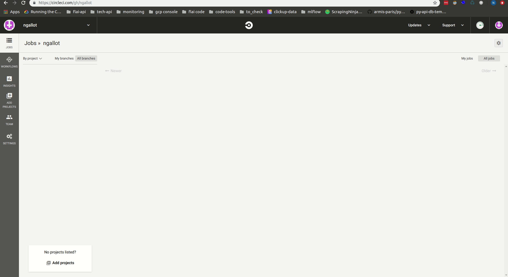
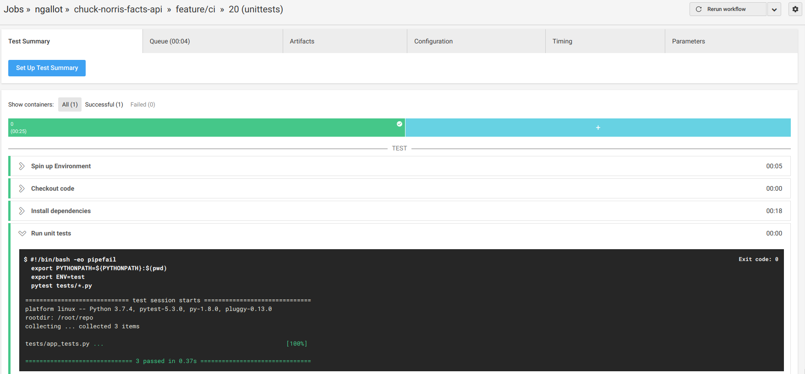
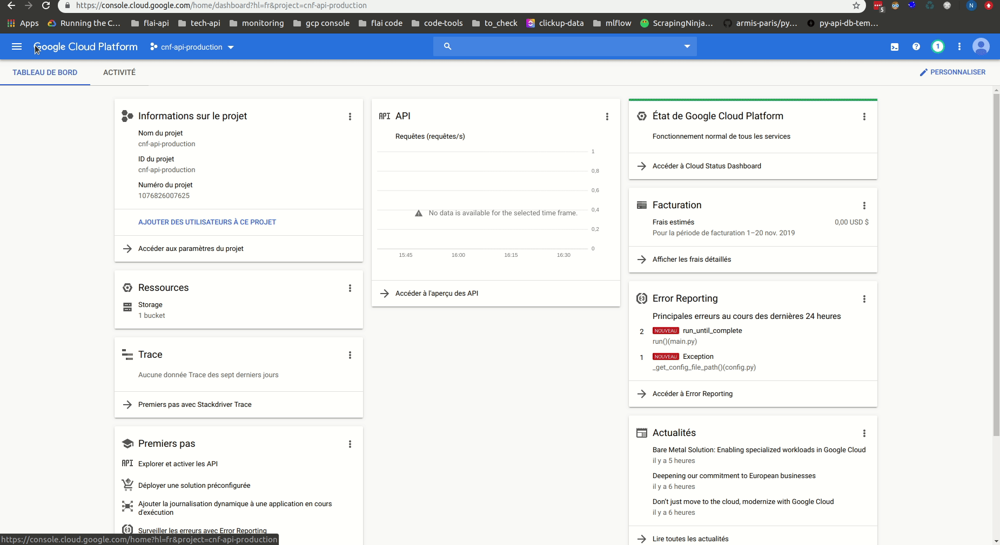
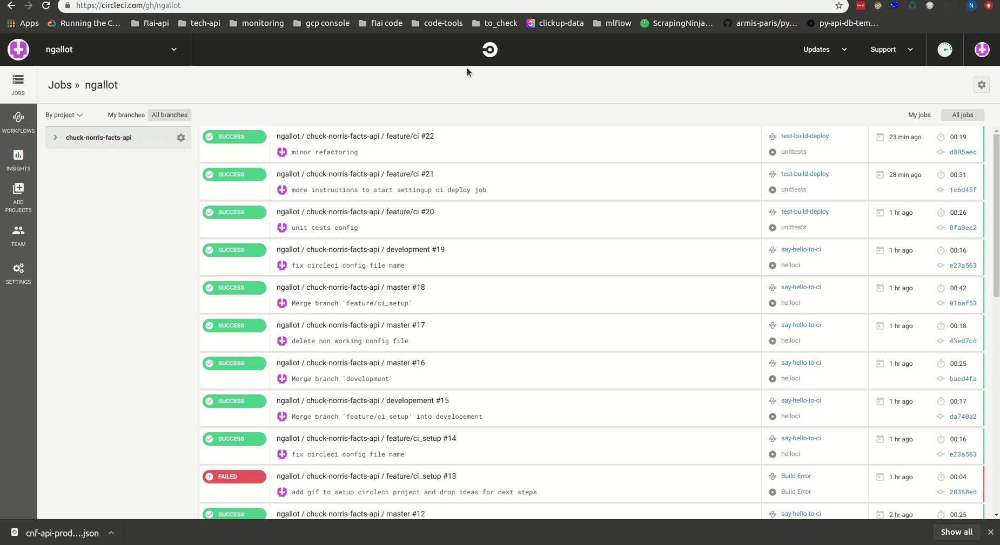

# Lab 2 - Deploying the api on Google Cloud Run

Duting the last lab, we've built a simple REST api in Python, working in a standalone Docker container, on our machine.
Now we want to expose this app and make it available to others, so we need to deploy it. There are a lot of technologies to do that 
(this is one of the main advantages to build our app in a Docker container). We will focus on 1 technology here: [Google Cloud Run](https://cloud.google.com/run/).
This technology allows to expose very easily a Docker container, with advantageous pricing and scalability.

Today, we will:
- Setup a project on the Google Cloud Platform
- Deploy our container manually to GCP Cloud Run
- Setup automatic deployment via Circle CI


#### Technologies used

Today we will discover 2 technologies:
- **GCP Cloud Run:** </br>
    This technology developped by Google, still in beta version, allows easy deployment of a containerized app exposing an http endpoint. As long as your app exposes an http endpoint, you can 
    deploy it to Cloud Run.
    
    The main advantages of Cloud Run are:
    - Serverless: no need to maintain your own infrastructure
    - Pricing: you are billed at the millisecond. When your deployed endpoint receives a request, a new instance is started and processes your request. Then after a couple of minutes,
    if no new incoming request is received, the instance is shut down. You only pay for the CPU time, and eventually network costs.
    - Scalability: when you deploy a container, you can specify how many concurrent requests it can handle. When this value is reached, any new request will start a new container instance.
    Ex: you set the max concurrency to 10, and send 100 requests ==> 10 instances will process your requests.
    
    The few cons of Cloud Run are:
    - Limited to 2G of memory
    - No persistent drive
    - Actually nothing is persistant: your container should be stateless.
    - Sometimes still a bit unstable
    - Timeout (15 minutes) to process your request. It's not really a disadvantage, because who wants to use an api that takes 15 minutes to reply...


- **Circle CI:** </br>
    This platform allow to automate actions triggered by changes in your code repository. There are multiple other CI/CD platforms, CircleCI is quite new. It contains a free membership, which is 
    actually more than sufficient for many needs. It is very simple to set up, we will go through those steps during the lab.
    
#### Setting up the GCP project
To execute this step, you should have a google cloud platform account, and a working gcloud command.

First, create a new project on the Google Cloud platform console by logging into the console. Call this project *_cnf-api-production_*.

After your project has been created, you should have something like this: 

<p align="center">
  
</p>

#### Installing the gcloud command line tool
To interact with Google Cloud Platform resources, you can use the Google Cloud Sdk. It includes 
a command line tool named gcloud.
I suggest you first follow the steps in the [quickstart](https://cloud.google.com/sdk/docs/quickstarts)*[]: 


#### Setting up the gcloud command to interact with our project
Let's run the below commands (1 by 1...) to set up the gcloud command line to be able to take actions on our project:

```bash
gcloud auth login       # Will open a web browser to enable google authentication
gcloud projects list    # Will list the projects associated to your account. Please write down the id (PROJECT_ID) of your project cnf-api-production.


# Setting up gcloud to interact with the cnf-api-production project
export PROJECT_ID=xxx   # The id of the project you just got from the previous step
export REGION=europe-west2-b

gcloud config list      # To see the current configuration of your gcloud command line
gcloud config set project ${PROJECT_ID} # To set the project to interact with
gcloud config set run/region ${REGION} # To set the default region to use for Cloud Run
```

#### Enabling necessary API's
For this project to work properly, we need to activate several api's on Google Cloud Platform:

- [Identity Access Management](https://cloud.google.com/iam/docs/reference/rest) (iam.googleapis.com)
- [Cloud resource manager](https://cloud.google.com/resource-manager/docs/apis) (cloudresourcemanager.googleapis.com): 
- [Google Container Registry](https://cloud.google.com/container-registry/) (containerregistry.googleapis.com)
- [Google Cloud Run](https://cloud.google.com/run/): (run.googleapis.com)

We can do this through the gcp console, or directly with the gcloud command line tool. Let's do it with gcloud (doc [here](https://cloud.google.com/sdk/gcloud/reference/services/enable)):
```bash
# Check the list of available services for our project:
gcloud services list --available

# Activate our 4 necessary apis:
gcloud services enable iam.googleapis.com cloudresourcemanager.googleapis.com containerregistry.googleapis.com run.googleapis.com --async

```

#### Deploying our API
Now that we've enabled the necessary apis, we can push our Docker container to Google Container Registry. It is a private Docker container registry,
working like a private DockerHub registry.


##### Pushing our docker container to Google Container Registry
First, we need to authenticate Docker before pushing the image to our private registry. We can use gcloud for that: 
```bash
gcloud auth configure-docker
```

Then, we need to give a special tag to our Docker image, to tell docker to push it to our private registry. Let's call our image cnf-api-production,
because  will deploy the production environment. The :latest means that it's the latest version. We could also put a semantic version here.
```bash
export DOCKER_TAG=gcr.io/${PROJECT_ID}/cnf-api-production:latest

docker build -t ${DOCKER_TAG} --build-arg config_file=production.ini . # NB: this step is not mandatory if we've already built the image with another tag. We could just add a new tag to the image.

```

And let's just push!
```bash
docker push ${DOCKER_TAG}
```

If you go to the gcp console and check out your images in the cloud container registry, you should see something like this:
<p align="center">
  
</p>

##### Setting up a container on Google Cloud Run
We're almost there, we just now need to deploy our image into a working container. This is where we'll use Google Cloud Run: a serverless architecture to run
docker images.

First, make sure that you've created the file env-vars/production.env, with contents ENV=production
The command
```bash
env_vars=$(cat env-vars/production.env  | paste -sd "," -)
```
will read this file, and extract its contents, separated by commas. This is the format gcloud expects when setting environment variables for a cloud run container.


```bash
export SERVICE_NAME=chuck-norris-facts-api
export ENV_VARS=$(cat env-vars/production.env  | paste -sd "," -)

gcloud beta run deploy ${SERVICE_NAME} \
    --image ${DOCKER_TAG} \
    --set-env-vars=${ENV_VARS} \
    --region europe-west1 \
    --platform managed \
    --allow-unauthenticated \
    --memory 1G
```

And voila! Our API is now available in the cloud, and it's not costing anything when not running. The gcloud command we just ran will
output the url where our api has been deployed. You can test it by executing an http request:
```bash
export API_URL=xxx # the value of the deployed url, returned by the gcloud command.
curl -X GET ${API_URL}/facts/ # will return all facts in our database
```


#### Deploying changes automatically: continuous deployment
In this section, we will see that we can do better than deploying our api manually. We will use
Circle CI to help us doing it automatically for us.
The very basic concept is that here, we've executed a list of commands manually to deploy our application.
Why not doing it automatically? After all it's just a set of bash commands to run. We can do this with Circle CI, by describing the list
of commands to be run when our GitHub repository changes, and they are automatically triggered.
Behind the hood, when the repo changes, and a trigger has been configured to take actions, Circle CI will:
- Start a VM in their own cloud
- Execute a list of actions that we will have configured in the Circle CI configuration file
- Stop the machine.

And all this comes for free with the Circle CI basic plan.


##### Making minimal configuration
Circle CI works with configuration files. Basically, this configuration file, in the yaml format (same as docker-comopose file), 
describes a list of actions to be taken by the machine executing it on Circle CI cloud. Let's build a minimal configuration, 
just to enable setting up the CI for our project:

- First: create a new branch called feature/minimal_ci
```bash
git checkout -b feature/minimal_ci
```

Then create a directory to host the circle ci configuration and create an empty config file:
```bash
mkdir .circleci
touch .circleci/config.yml
```

Add the below contents to the .circleci/config.yml:
```yaml
version: 2.0
jobs:

  helloci:
    working_directory: ~/repo
    docker:
    - image: google/cloud-sdk:slim
    steps:
    - checkout
    - run:
        name: Say Hello
        command: |
          echo Hello Circle CI!


workflows:
  version: 2
  say-hello-to-ci:
    jobs:
    - helloci
```

We define here a dummy job, outputting "Hello Circle CI" on the console. It will first pull the google/cloud-sdk:slim Docker image, then 
checkout our code, and finally run our Say Hello command.

Then push your changes, and merge this branch to master:
```bash
git status
git add .circleci
git commit -m 'minimal working configuration'
git push

git checkout master
git pull
git merge feature/minimal_ci
git push
```


##### Setting up Circle CI to interact with your project
The first step here, after creating an account on CircleCi, is to setup your project.

For that, go to the CircleCI console, and click ADD PROJECTS. Select your GitHub chuck-norris-facts-api project, then go directly 
to "start building". You can still read the instructions, but we will setup the configuration ourselves.

<p align="center">
  
</p>

You're done! You can now start to enjoy automated builds!

##### Writing a real Circle CI configuration file
NOw that we've demonstrate how to write a dummy circle ci config file, triggering actions from GitHub, let's implement the steps we've ran manually to deploy our app.

##### The unit tests job
If we follow the git-flow process described in week 1, we know that:
- we should not push code directly to protected branches (ie branches that are deployed in a proper environment)
- we should run unit tests to check that we did not break anything in the code

Hence we should setup a ci job to run unit tests, on any branch that is not master (because master is only there to be deployed to cloud run).

You can set up the below circle ci config file, in a new branch feature/ci_jobs:
```yaml
version: 2.0
jobs:

  unittests:
    working_directory: ~/repo
    docker:
    - image: tiangolo/uvicorn-gunicorn-fastapi:python3.7
    steps:
    - checkout
    - run:
        name: Install dependencies
        command: |
          pip install -r test-requirements.txt
    - run:
        name: Run unit tests
        command: |
          export PYTHONPATH=${PYTHONPATH}:$(pwd)
          export ENV=test
          pytest tests/*.py

workflows:
  version: 2
  test-build-deploy:
    jobs:
    - unittests:
        filters:
          branches:
            ignore:
            - master
``` 
Once you've done that and pushed your changes, you should see something beautiful like this:

<p align="center">
  
</p>

Next thing to do, is at the GitHub level: protect our master branch by enforcing that incoming pull requests MUST run the unit tests successfully:
- Go to your repo page on GitHub
- Go to the Settings tab
- In the "Branches" section, click "Add rule" next to the Branch protection rules
- Then protect the master branch by: 
    - Clicking "Require pull requests review before merging
    - And to include the CI step: click Require status checks to pass before merging, and click ci/circleci: unittests. Then click save.
    
With this setup, you're now sure that:
- Any code pushed to the master branch will be submitted to a code review, via a pull request
- Any incoming pull request on master will have to pass the unit tests

In other words, you can now sleep peacefully, no one will mess up with your api.

##### The deployment job
Now that we've set up a CI job to handle the run of the unit tests, we can do the same to deploy our app from the master branch.

One problem here: at the beginning of the manual deployment step, we had to manually authenticate the gcloud command line by running
```bash
gcloud auth login
```
The we were redirected to a web browser to validate our credentials. We can't automate that. Oh, wait, yes we actually can, through [service accounts](https://cloud.google.com/iam/docs/understanding-service-accounts).

###### Setting up the circleci service account
We will use a dedicated service account to handle deployment tasks from the ci machine. For that:
- go to the google cloud platform console
- on the upper left, click on the 3 bars to show the menu
- go to IAM et administration
- on the left, go to service accounts
- click create a service account
- enter the details of your service account
- select the *editor* role
- click Continue, then create a json key and save it locally

<p align="center">
  
</p>

Once this is done and you've downloaded the json credentials file, put it in a folder called credentials at the root of your project
and name it ci-production.json:
```bash
mkdir credentials
mv ~/Downloads/xxx-yourcredentialfile.json credentials/ci-production.json
```

**DO NOT FORGET TO ADD THE CONTENTS OF THE CREDENTIALS FOLDER TO THE .gitignore FILE!!**<br />
Otherwise anyone with access to your (probably open source) repo can
do anything on your Google Cloud Platform account.


You can now test the credentials file by trying to authenticate gcloud with it:
```bash
gcloud auth activate-service-account --key-file credentials/ci-production.json
```


Now let's start building from circle ci. As the credentials file is not commited on the repository, the CI machine
won't have access to it. We need to find a mechanism to make it available to the CI. Luckily, Circle CI have utils for that, and we'll do
it by exporting an environment variable to Circle CI, containing the contents of our json file.

- First, copy the contents of your json file in your clipboard
- Go the the Circle CI UI
- In the JOBS section, click on the wheel next to your project
- Click Environment variables, under BUILD SETTINGS
- Click Add Variable, then name your variable CI_JSON_CREDENTIALS_PRODUCTION, and paste the contents of your json file in the value field.

<p align="center">
  
</p>


The second thing we need to make available to the CI machine are the environment variables file.
You can repeat the same process, by exporting the file env-vars/production.env as an environment variable named ENV_VARS_PRODUCTION in circle ci.

Lastly, we need to export the PROJECT_ID environment variable in Circle CI.


##### Writing the deployment job
We're now ready to write the steps to deploy our container to Cloud Run. In a new branch, modify your config.yml file like this:
```yaml
version: 2.0
jobs:

  unittests:
    working_directory: ~/repo
    docker:
    - image: tiangolo/uvicorn-gunicorn-fastapi:python3.7
    steps:
    - checkout
    - run:
        name: Install dependencies
        command: |
          pip install -r test-requirements.txt
    - run:
        name: Run unit tests
        command: |
          export PYTHONPATH=${PYTHONPATH}:$(pwd)
          export ENV=test
          pytest tests/*.py

  deploy:
    working_directory: ~/repo
    docker:
    - image: google/cloud-sdk
    steps:
    - checkout
    - setup_remote_docker
    - run:
        name: Create credentials file
        command: |
          mkdir credentials
          echo $CI_JSON_CREDENTIALS_PRODUCTION >> credentials/ci-production.json
    - run:
        name: Create environment variables file
        command: |
          mkdir env-vars
          echo $ENV_VARS_PRODUCTION >> env-vars/production.env
    - run:
        name: Authenticate gcloud
        command: |
          gcloud auth activate-service-account --key-file credentials/ci-production.json
          gcloud config set project ${GCP_PROJECT_ID}
    - run:
        name: Push docker image
        command: |
          export DOCKER_TAG=gcr.io/${GCP_PROJECT_ID}/cnf-api-production:latest
          docker build . \
            -t ${DOCKER_TAG} \
            --build-arg config_file=production.ini
          gcloud auth activate-service-account --key-file credentials/ci-production.json
          gcloud auth configure-docker --quiet
          docker push ${DOCKER_TAG}
    - run:
        name: Deploy Cloud Run Container
        command: |
          export DOCKER_TAG=gcr.io/${GCP_PROJECT_ID}/cnf-api-production:latest
          export ENV_VARS=$(cat env-vars/production.env  | paste -sd "," -)
          gcloud beta run deploy chuck-norris-facts-api \
              --image ${DOCKER_TAG} \
              --set-env-vars=${ENV_VARS} \
              --region europe-west1 \
              --platform managed \
              --allow-unauthenticated \
              --memory 1G


workflows:
  version: 2
  test-build-deploy:
    jobs:
    - unittests:
        filters:
          branches:
            ignore:
            - master
    - deploy:
        filters:
          branches:
            only:
            - master

```

You will notice that it's basically the same commands that we ran manually.

In the workflows section, you can notice that:
- we're running unit tests only on branches different than master
- we're deploying only the master branch

NB: there is one step mandatory to make all this work:
```yaml
steps:
    - setup_remote_docker
```
Without this, all docker commands will not run. Because here, we're running docker inside a docker image!

Once you've pushed those changes, you should be able to see your container running on GCP platform!

<p align="center">
  
</p>


#### Next steps
In this lab we've shown how to automate the deployment of our app, on a specific cloud infrastructure: Google Cloud Run.
If you want to explore further, some ideas could be: 
- Deploying a development and staging environment: because here we only have a production environment and it's clearly not enough for a real case scenario. It's very easy to do: no python code change is required!
Just set up the env vars file, config (.ini) files and gcp projects.
- Deploy to another cloud infrastructure: Google Cloud Run is great for our needs, but could be limited for other use cases. You could want to 
deploy somewhere else
- Explore the possibility to add artifacts to your builds on Circle CI:
    - tests reports
    - test coverages
    - ...<br />
 
 Have fun building awesome things!
 